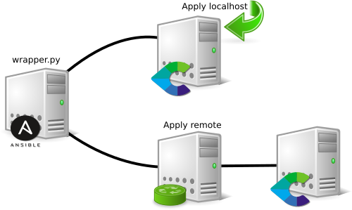

# Ansible Centreon Configurator

Table of Contents

- [Overview](#overview)
- [Versions](#versions)
  * [18.10.0](#18.10.0)
- [Requirements](#requirements)
  * [Operating systems](#operating-systems)
- [Installation](#installation)
- [Role Variables](#role-variables)
- [Examples](#examples)
  * [Scenarios](#scenarios)
  * [Simple Example](#simple-example)
  * [Complex Example](#complex-example)
- [Screencasts](#screencasts)
- [License](LICENSE)

# Overview



The `wrapper` is built to intermediate the apply of objects configured in a single template and can be applied remotely through a set of predefined instructions and using the Centreon webapi tools for configuration in the environment.

# Versions

## 18.10.0

Version with synchronized functions for version 18.10.0 of the Centreon

# Requirements

## Operating systems

This role will work on the following operating systems:

 * Red Hat / Centos
 * Debian
 * Ubuntu
 * Windows (coming soon)

# Installation

## Using GIT

```bash
cd ~/work-dir
git clone https://github.com/centreon/centreon-iac-ansible-configurator.git
cd centreon-iac-ansible-configurator
```

## Using Ansible Galaxy

Coming soon

# Role Variables

* `centreon_webapi_host`: Host or ip to connect in WebAPI
* `centreon_webapi_port`: TCP port to connect in WebAPI
* `centreon_admin_password`: Password used by Administrator user
* `configuration`: Is a dictionary variable with values to use for template of objects. You must use the same names defined in the Centreon [WebAPI documentation](https://documentation.centreon.com/docs/centreon/en/latest/api/clapi/objects/index.html)

Sample values for the variable `configuration`:
```yaml
        cg:
        - {
          'name': 'testers',
          'alias': 'Testers contacts'
          }
        contacts:
        - {
          'name': 'Test contact One',
          'alias': 'test01',
          'email': 'test01@test.centreon.com',
          'password': 'easypass',
          'admin': '0',
          'gui': '1',
          'language': 'en_US',
          'auth': 'local',
          'state': 'enabled' # enabled, disabled, absent
          }
        host:
        - {
          'name': 'test01',
          'alias': 'Server teste 01',
          'address': '127.0.0.1',
          'template': 'generic-active-host-custom',
          'instance': 'central',
          'hostgroup': '',
          'state': 'enabled' # enabled, disabled, absent
        }
```

# Examples

## Scenarios

You can create playbooks to add a set of objects directly to Centreon, or you can create the objects into separate playbooks for each host you add using Ansible.

For example, to create a host with a webserver service with Nginx, you can have a playbook as defined [here: deploy-nginx.yml](deploy-nginx.yml)

## Simple example

```yaml
---

- name: Add monitor to Centreon
  hosts: webserver
  remote_user: root

  roles:
  - role: "roles/centreon-config"
    centreon_admin_password: "p4ssw0rd"
    centreon_webapi_host: "http://192.168.150.10"
    centreon_webapi_port: "80"
    configuration:
        cg:
        - {
          'name': 'testers',
          'alias': 'Testers contacts'
          }
        contacts:
        - {
          'name': 'Test contact One',
          'alias': 'test01',
          'email': 'test01@test.centreon.com',
          'password': 'easypass',
          'admin': '0',
          'gui': '1',
          'language': 'en_US',
          'auth': 'local',
          'state': 'enabled' # enabled, disabled, absent
          }
        host:
        - {
          'name': 'test01',
          'alias': 'Server teste 01',
          'address': '127.0.0.1',
          'template': 'generic-active-host-custom',
          'instance': 'central',
          'hostgroup': '',
          'state': 'enabled' # enabled, disabled, absent
        }
```

## Advanced example


We may have a situation where Ansible may not have access directly to Centreon, only through a host that is located between the Ansible network and the DMZ where the Centreon is located. For these scenarios, you will either have to use a specific host or use the services client that Centreon will monitor.

# Screencasts

(Coming soon)
